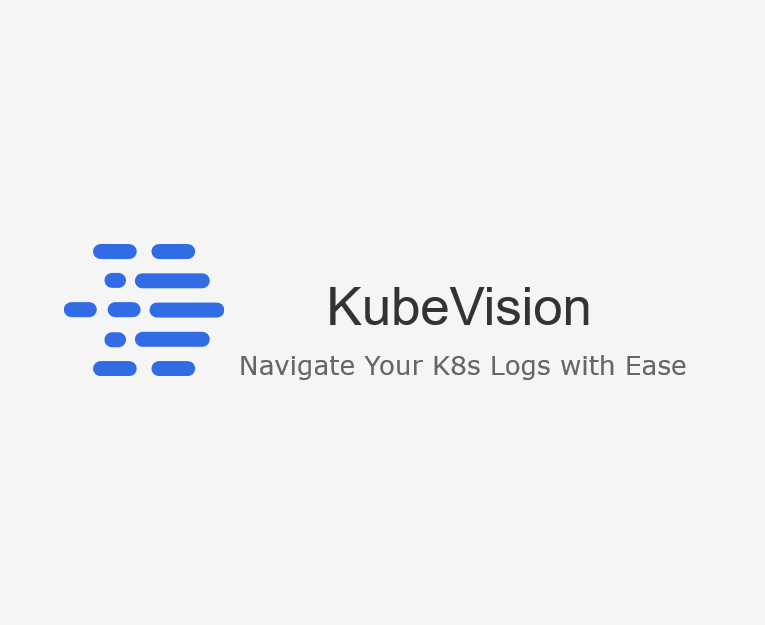

# KubeVision: Real-time Kubernetes Log Visualizer

Welcome to KubeVision, a project that showcases real-time log visualization within a Kubernetes environment. Written entirely in Go, KubeVision is designed to process and stream logs live, providing immediate insights into your Kubernetes applications.

## Features

- **Real-time Log Processing**: KubeVision processes log streams in real-time, providing you with valuable insights instantly. It's a fantastic tool for understanding the dynamics of your Kubernetes applications.

- **Random Log Generator**: To simulate real-world conditions, we've included a random log generator. This utility generates random logs that KubeVision can consume and process, mimicking the behavior of a live Kubernetes application.

- **Go-Powered**: The project is entirely written in Go, leveraging the language's efficiency and concurrency capabilities to provide a performant, robust log visualization tool.

## Getting Started

To get started with KubeVision, you'll need to have Go, Docker, and Kubernetes installed. The instructions below provide a step-by-step guide to setting up and running KubeVision.

### Prerequisites

- Go version 1.16 or later.
- Docker version 20.10 or later.
- Access to a Kubernetes cluster. You can use Minikube for a local setup.

### Installation

1. Clone the repository to your local machine.
2. Navigate to the `kubevision` directory.
3. Run `go build -o kubevision`. This will compile the Go code and generate an executable named `kubevision`.

### Usage

1. Start the random log generator: Navigate to the `random_logs` directory and run `go run main.go`. This will start generating random logs.
2. Start KubeVision: Navigate back to the `kubevision` directory and run `./kubevision`. KubeVision will now start processing the logs generated by the random log generator.

## Codebase

The codebase is structured into two main applications: the KubeVision app and the Random Log Generator.

### KubeVision

The main entry point for the KubeVision app is `kubevision/main.go`. Here's a brief overview of the main components:

- `kubevision/cmd/stream.go`: Handles the streaming of logs.
- `kubevision/cmd/get.go`: Fetches the logs for processing.
- `kubevision/cmd/process.go`: Processes the logs and provides insights.
- `kubevision/cmd/root.go`: The root command for the CLI application.

### Random Log Generator

The main entry point for the Random Log Generator is `random_logs/main.go`. This utility generates random logs, simulating a real-world Kubernetes application for testing purposes.

## Contributing

Contributions are always welcome! If you have an idea for improving KubeVision or the Random Log Generator, don't hesitate to fork the repository and submit a pull request.

## License

This project is licensed under the terms of the MIT license. See the `LICENSE` file for more details.